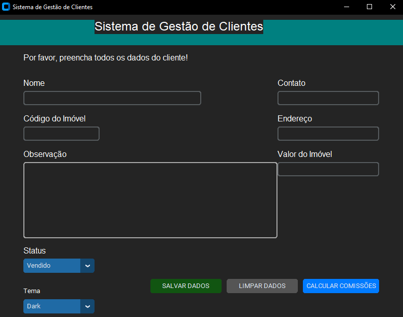
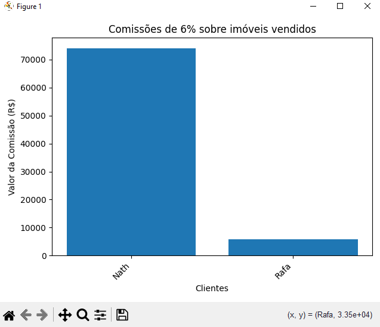
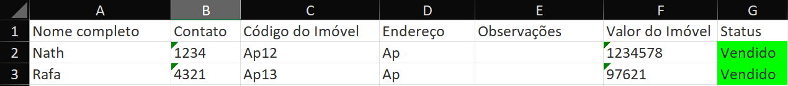

# Imovi Excel App

O Imovi Excel App é uma aplicação de gestão de imóveis feita em Python, utilizando customtkinter para criar uma interface gráfica moderna e intuitiva. O sistema permite cadastrar informações de clientes e imóveis, exportar dados para um arquivo Excel, e calcular comissões sobre imóveis vendidos.

## Imagens




## Tecnologias Utilizadas:

° Python: Linguagem de programação principal utilizada.
° CustomTkinter: Biblioteca para criar a interface gráfica personalizada e moderna.
° Openpyxl: Biblioteca para manipulação e leitura de arquivos Excel (.xlsx).
° Matplotlib: Usada para geração de gráficos para cálculo de comissões.

## Funcionalidades:

° Cadastro de Clientes e Imóveis: Os usuários podem inserir dados como nome do cliente, contato, código do imóvel, endereço, valor do imóvel, observações, e status do imóvel.
° Status do Imóvel: Existem três status para cada imóvel, sendo eles:
° Vendido: Aparece em verde no arquivo Excel.
° Encerrado: Aparece em vermelho no arquivo Excel.
° Em processo: Aparece em amarelo no arquivo Excel.
° Cálculo de Comissão: Através de um botão, o sistema exibe um gráfico que mostra o nome do cliente e a comissão calculada (6% sobre o valor do imóvel vendido).
° Exportação para Excel: Todos os dados são salvos e organizados automaticamente em um arquivo Excel na área de trabalho do usuário.

## Instalação

Clone o repositório para a sua máquina:

```bash
Copiar código
git clone https://github.com/NatHanNSilva12/imovi-excel-app.git
```
Instale as dependências necessárias:

```bash
Copiar código
pip install -r requirements.txt
```
Execute o programa:

```bash
Copiar código
python app.py
```
## Uso
Cadastro de Dados: Preencha os campos com as informações dos clientes e imóveis.

Salvar Dados: Clique no botão "Salvar Dados" para enviar as informações ao arquivo Excel.

Cálculo de Comissões: Clique no botão "Calcular valores aproximados de comissões" para visualizar o gráfico das comissões de 6% sobre o valor dos imóveis vendidos.

Estrutura do Projeto
app.py: Arquivo principal da aplicação.
requirements.txt: Lista das bibliotecas e versões necessárias para executar o projeto.

## Contribuições
Sinta-se à vontade para contribuir com o projeto enviando um Pull Request.

## Licença
Este projeto está licenciado sob a MIT License.
